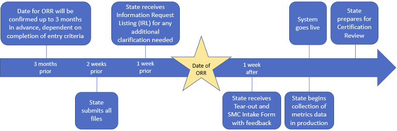
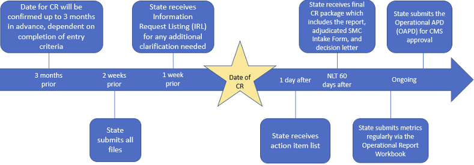

# Streamlined Modular Certification Process 

As outlined in the [State Medicaid Director Letter (SMDL) #22-001](https://www.medicaid.gov/federal-policy-guidance/downloads/smd22001.pdf), released on April 14, 2022, states may request enhanced Federal Financial Participation (FFP) at 75% of expenditures for the operation of a Mechanized Claims Processing and Information Retrieval Systems (MCPIRS) following adherence to the [Streamlined Modular Certification (SMC) process](https://www.medicaid.gov/medicaid/data-and-systems/downloads/smc-certification-guidance.pdf) for Medicaid Enterprise Systems (MES).

This page includes information supplemental to the SMC Guidance. It does not replace the SMC Guidance but includes additional details for states to help them navigate the certification process.

The Advanced Planning Documents (APD) is the starting point of the process and should include Conditions for Enhanced Funding (CEF), CMS-required outcomes, state-specific outcomes, and metrics. These conditions, outcomes, and metrics will be used throughout the SMC process.

After the APD is approved and prior to releasing an RFP, the state should copy the CMS-required outcomes, state-specific outcomes, and metrics from the APD to the SMC Intake Form Template. Once this is drafted, it can be discussed with the CMS Certification Team and a preliminary list of evidence should be added for the CEF, Outcome and Metrics, and Required Artifacts tabs. Those determined as not applicable should include the reason why it is not applicable to the module’s certification. The drafted Intake Form will then be used throughout the process and updated as needed. Refer to the [Intake Form guidance](../Intake Form/) for filling out the Intake Form.

## Entry Criteria 

The calendar opens three months before each review month (for example, on January 1, March dates become available). States may request an ORR or CR at any time, but a review date can only be confirmed once the calendar for that month has opened and the state has submitted its materials and received entry criteria confirmation. 

Note that meeting the entry criteria only clears the way for scheduling the review (ORR or CR). Two weeks prior to the review, the state must provide the most up-to-date documents in the applicable certification [Box folders](../Box/) for evaluation by the CMS Certification Team.

Prior to scheduling an **ORR**, the state must provide the following to the CMS Certification Team:
- Anticipated Go-live date
    -	The state should also provide detailed go/no-go exit criteria and the decision date.
-	User Acceptance Testing (UAT) completion date
    - The state must provide a timeline for when UAT for go-live functionality will be complete. Additional guidelines can be found in the [MES Testing Guidance Framework](https://www.medicaid.gov/medicaid/data-and-systems/downloads/mes-testing-guidance-framework.pdf).
-	Operational Reporting / Metrics
    -	Latest Intake Form
        - This can be a draft but will need to be finalized and loaded to the applicable certification Box folder two weeks prior to the actual review. 
    -	The following files or a projected timeline for completion:
        - The independent, third-party security and privacy controls assessment report (SAR) and penetration test results conducted within the last two years, per 45 C.F.R. § 95.621(f)(3), from the requested ORR date.
        - Plan of Action & Milestones (POA&M) documenting the most recent status of vulnerabilities regardless of risk level (from SAR, penetration tests, vulnerability scans, disaster recovery test results).
            - All critical vulnerabilities should be resolved prior to scheduling a review date. However, states can request a review date with unresolved critical items if a mitigation/remediation plan is submitted using the recommended risk acceptance template, which can be found in Attachment D of the CMS Information Security POA&M Procedure document.

Prior to scheduling a **CR**, the state must provide the following to the CMS Certification Team:

- Operational Reports
    - Latest Intake Form
        - This can be a draft but will need to be finalized and loaded to the applicable certification Box folder two weeks prior to the review. 
    - Metric data back to the requested systems approval date
        - States must submit data back to the go-live date (or the date requesting retroactive certification), up to the most recent month end.
    - The independent, third-party SAR and penetration test results conducted within the last two years from the requested CR date.
    - Most recent POA&M documenting the status of vulnerabilities (from SAR, penetration tests, vulnerability scans, and disaster recovery test results).
        - All critical vulnerabilities should be resolved prior to scheduling a CR date. However, states can request a review date with unresolved critical items if a mitigation/remediation plan is submitted and approved by CMS, using the recommended risk acceptance template, which can be found in Attachment D of the CMS Information Security Plan of Action and Milestones (POA&M) Procedure document.
- Once the above activities have been completed, the state may submit the Certification Request Letter
    - The letter should align with the [example template](../Templates/) posted on the MES Certification Repository.
    - The letter should include all information required for inclusion in [SMDL 22-001](https://www.medicaid.gov/federal-policy-guidance/downloads/smd22001.pdf). See the [example System Acceptance Letter](../Templates) on the MES Certification Repository.
    - Send the Certification Request Letter and applicable attachments via email to <MES.Certification@cms.hhs.gov>.
    - Since the Certification Request Letter and the System Acceptance Letter are also SMC Required Artifacts (see SMC Guidance), these documents must also be uploaded to the applicable [Box folder](../Box/) for certification.
- The CMS Certification Team will contact the CMS T-MSIS team to get confirmation via email that the state and system being certified meet all Outcomes-Based Assessment (OBA) compliance.

## Operational Readiness Review (ORR)

Following the entry criteria, below is the high-level timeline of activities that will take place during an ORR. For more details on what is required, please see the SMC Guidance. 

## Certification Review (CR)

Following the entry criteria, below is the high-level timeline of activities that will take place during a CR. For more details on what is required, please see the SMC Guidance. 

Once a system is in production, states should be able to regularly and consistently provide metrics that demonstrate the system complies with applicable regulations and meets outcomes. States begin reporting on metrics after go-live and before the Certification Review. From then on, as long as the state continues to receive enhanced funding for its MES solution, metrics should be submitted to CMS monthly. The ORWs of EVV modules must be submitted quarterly at a minimum (broken down by month), with monthly reporting recommended for timely updates.

## Best Practices/Tips

- The state must use the exact filename(s) loaded in CMS Box when populating the evidence columns in the intake form (do not use hyperlinks).
- Evidence and required artifacts can be existing documentation already required by the state (typically stated in RFP as deliverables from the DDI), ultimately reducing, or eliminating the additional level of effort associated with “evidence curation” for reviews. There is no need to create a “package” or new file for evidence. However, CMS reserves the right to request updated documentation, as needed, to satisfy the needs for certification.
- Transformed Medicaid Statistical Information System (T-MSIS)
    - The state should confirm with the Division of Information Systems (DIS) State Liaison (CMS T-MSIS team) if the state will be required to go through the T-MSIS large system enhancement (LSE) Standard Operating Procedure (SOP). If so, the [T-MSIS LSE SOP](../TMSIS%20Reporting%20Impacts%20SOP%20V1.4%20LSE%20SOP.pdf) requires extensive artifacts and testing so the timeline should be carefully considered when considering planning for review.
    - Recommend getting confirmation in writing from CMS DIS State Liaison that T-MSIS LSE SOP is not applicable for the scope of this DDI.
    - If it is applicable to the scope of the DDI, then the schedule should reflect the required artifacts and testing timelines.
- All testing-level tasks should be included in the state’s project plan.
- If the state is conducting an Eligibility & Enrollment (E&E) review, the state must provide the most recent Authority to Connect (ATC) to the CMS Hub approval letter in addition to the CEF evidence. 
- Operational procedures should be documented prior to the Operational Readiness Testing so these procedures can be tested and updated prior to go-live.
- If a state is using agile methodology or is taking a phased approach to implementation, the state and the CMS Certification Team will decide the appropriate point at which to conduct the ORR and CR. The state must map the phases to the applicable CMS-required and state-specific outcomes to help the CMS Certification Team determine when to hold the ORR and CR.
- At the beginning of the Design, Development, and Implementation (DDI) phase, the state should develop a Master Test Plan, in consultation with the [Testing Guidance Framework](https://www.medicaid.gov/medicaid/data-and-systems/downloads/mes-testing-guidance-framework.pdf). 
- States are encouraged to utilize the sample agendas, but can use their own template if the appropriate topics are included, see the examples on the Templates page.
- CMS encourages states to include all appropriate programs, business operations, and subject matter experts in the reviews.
- State may update their metrics over time but must discuss the changes with their CMS MES State Officer and submit an updated APD.

## Resources

- [SMDL # 22-001](https://www.medicaid.gov/federal-policy-guidance/downloads/smd22001.pdf), released on April 14, 2022
- [SMC Guidance](https://www.medicaid.gov/medicaid/data-and-systems/downloads/smc-certification-guidance.pdf)
- [Code of Federal Regulations](https://www.ecfr.gov/current/title-42/chapter-IV/subchapter-C/part-433)
- [Writing a good outcome statement](../writing-outcome-statements.md)
- [Templates](../Templates/)
- [Metrics and Ongoing Reporting](../Ongoing Reporting/Overview/)
- [CEF Example Evidence, Tips, and Best Practices](../Conditions for Enhanced Funding/CEF Tips/)
- [Intake Form Guidance](../Intake Form/)
- [Medicaid Enterprise Systems Testing Guidance Framework](https://www.medicaid.gov/medicaid/data-and-systems/downloads/mes-testing-guidance-framework.pdf)
- [Using Box](../Box/)
- [SMC Kickoff](../SMC%20Kickoff%20Deck.pptx)

## References
